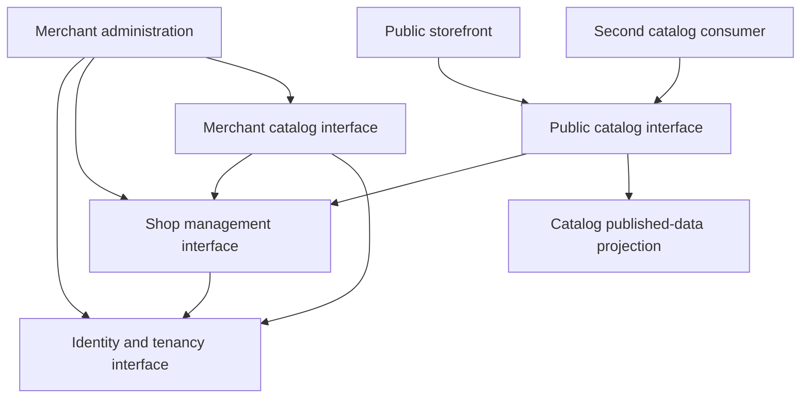
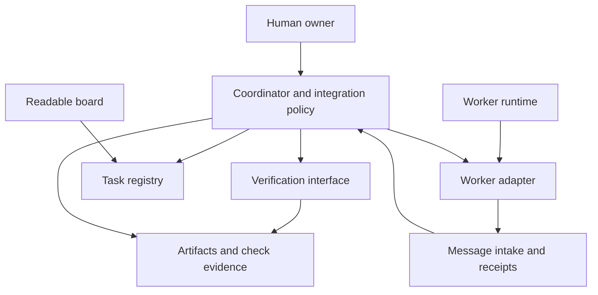

# 9. Module dependencies and contract ownership

[Overview](README.md) · [Roadmap](04-roadmap-of-thought.md) · [Contract drafts](contracts/README.md) · [Current board](coordination/BOARD.md)

Recorded 2026-09-11T15:09:28Z. The owner accepted the module proposal and a modular monolith for the commerce backend. The dependency details and assignment sequence below develop that direction for review; they are not deployed code, accepted wire schemas, or worker grants.

## Track A: commerce module map

One commerce backend deployment contains identity/tenancy, shops, and catalog modules with explicit interfaces. Merchant administration and storefront are separate logical client surfaces; whether they share a frontend build/deployment remains open. Agent count does not determine application or deployment count.

In this diagram, arrows mean “may call the public interface of.” They do not grant direct storage access.

The two catalog interfaces and published-data projection belong to the same catalog module. They are not independent services or extra agent roles. Identity/tenancy does not call shops or catalog, avoiding a circular authorization dependency.

| Module | Owned data and behavior | Allowed dependencies | Boundary to preserve |
|---|---|---|---|
| Identity and tenancy | Authenticated principals, tenant membership, permission decisions, scoped grants where needed. | Selected identity integration and its own persistence. | Evaluate access using trusted resource context; never infer authorization from caller-supplied tenant IDs. |
| Shops | Shop identity, tenant association, creation, validated public-route mapping. | Identity/tenancy interface. | Supplies trusted shop-to-tenant context; cannot read or mutate catalog data directly. |
| Catalog | Product drafts, immutable publication, public field projection, product storage. | Shops and identity/tenancy interfaces. | Resolves product's actual shop before authorization; no bypass through request identifiers. |
| Merchant administration | Shop creation and draft/publish interaction state. | Identity, shop management, and merchant catalog APIs. | UI controls do not replace server authorization; no database access. |
| Storefront / second consumer | Public presentation and UI state. | Public catalog API, which resolves the shop route server-side. | No merchant/private payloads, catalog internals, or direct storage access. |

Module data ownership is a code-access rule even if the first backend uses one database. Each module accesses its own tables through its own persistence code. Shared-database foreign keys may enforce integrity, but they do not authorize cross-module reads or writes. Repository/package checks and review must enforce the chosen import boundaries once the stack exists.

## Trace one publication request

1. The merchant UI submits product and shop identifiers with the authenticated session.
2. Catalog retrieves the product's actual association from its own storage and resolves trusted shop/tenant context through Shops. Inaccessible-resource responses must not disclose existence.
3. Identity/tenancy evaluates the principal's permission for that context. Catalog rejects mismatched route/product scope and unauthorized operations.
4. Catalog performs the authorized draft-to-published transition and required visibility handling before reporting success.
5. A public catalog request resolves the public shop route through Shops, reads only that shop's published projection, and returns the allowed fields.
6. The storefront renders the response. Existing and second consumers use the same public contract.

Shop creation follows a different path: Shops authorizes tenant access through Identity/tenancy before creating its own data. Exact membership/grant structures and transaction/authorization consistency semantics must be specified before foundation implementation; this map does not settle them silently.

## Track B: coordination component map

Arrows describe interactions, not a permission grant for arbitrary execution. Adapter-to-message traffic reports events; only coordinator-authorized transitions change the registry. Verification returns evidence/findings; the coordinator owns acceptance state. The protocol must prevent event feedback from generating repeated starts or duplicate transitions.

| Component | Responsibility | Implementation boundary |
|---|---|---|
| Task registry | Versioned state, generation, prerequisites, ownership, timestamps, evidence references. | One state authority; validates transitions and ownership invariants. No model-provider-specific decisions. |
| Message intake | Message identity, receipts, deduplication, reply linkage, stale-version signaling. | Receipt is not a grant or successful task completion. |
| Worker adapter | Runtime start/status/cancel/result translation and capability declarations. | Cannot choose tasks or approve its own results; cannot write registry state directly. |
| Verification interface | Check artifact identity, obligations, required scenarios, and integration revision. | Does not waive failed checks or change accepted requirements. |
| Coordinator/integrator | Assignment policy, dependencies, contract-change impact, review routing, acceptance. | Respects human authority and explicit budgets. |

For the supervised pilot, these responsibilities are performed by the lead session, task board, individual messages, and manual checks. The graph is the target separation for future implementation, not proof that services exist. tmux sits beneath terminal/runtime access; replacing it must not redefine the task/result protocol.

## Shared contract ownership

“Owner” below names an accountable role; the coordinator must bind it to a real assignment before work starts. Contract identifiers are planning names, with exact schemas/versions still pending.

| Contract / shared artifact | Sole steward | Implementing responsibility | Affected consumers / reviewers |
|---|---|---|---|
| Principal and authorization context | Coordinator as contract steward | Foundation implementer | Shops, catalog, and authorization verifier |
| Shop creation and public resolution | Coordinator as contract steward | Foundation implementer | Merchant UI, catalog, storefront journey verifier |
| Product mutation and public projection | Coordinator as contract steward | Catalog implementer | Merchant UI, storefront, second consumer, integration verifier |
| Assignment, task state, and message envelopes | Coordinator as contract steward | Coordination protocol implementer | Worker adapters, board interface, recovery verifier |
| Runtime capability and lifecycle interface | Coordinator as contract steward | Worker-adapter implementer | Coordinator, verification and recovery consumers |
| Root manifests, lockfiles, generated clients, shared migrations, CI | Coordinator/integrator | One explicitly assigned writer per batch | Every affected implementer and verifier |
| Acceptance-obligation mapping | Coordinator maintains accepted requirements | Test implementer authors checks; independent verifier reviews coverage | All affected providers and consumers |

A worker can propose a contract change with evidence. It cannot modify the canonical contract and update only its own consumer. The steward identifies every affected assignment, checks compatibility or seeks owner approval, and rebaselines the impacted work before integration.

## Proposed sequence of assignments

| Stage | Track A work | Track B work | Gate before dependent implementation |
|---|---|---|---|
| Design baseline | Pin foundation/publication schemas, validation/error semantics, and test fixtures. | Pin task/result/message fields and lifecycle scenarios. | Accepted boundary decisions, required context, and review of shared obligations. |
| Connected foundation | One writer establishes startup/checks, principal/shop resolution, fixtures, and a minimal connected API/client path. | Exercise existing manual board/assignment procedure; specify evidence locations. | Real runnable foundation and recorded commands; no unverified placeholder auth treated as complete. |
| Bounded product work | Catalog first, or catalog/UI workers against settled contracts if work is independently substantial. | Run supervised assignments and messages; investigate protocol gaps without changing active rules silently. | Each assignment has exclusive scope, actual baseline, budget, and meaningful checks. |
| Integration | Combine catalog, merchant UI, and storefront; execute required real journey and denial scenarios. | Verify generations, artifacts, messages, and integrated evidence. | Required provider/consumer and integrated checks pass at the combined revision. |
| Extension | Fresh worker adds second catalog consumer under the same interface. | Later adapter replacement after an actual adapter exists. | Existing behavior preserved, applicable conformance checks passed, and change effort measured. |

The initial module boundaries support parallelism but do not require it. Start with the single-worker baseline for measurement. Introduce up to two workers only when prerequisites, ownership, and integration capacity permit. Identity and shop foundations are tightly coupled enough to assign to one worker initially. Independent cross-component review remains a separate checkpoint.

## Boundary verification to add to the experiment

- Import/dependency checks reject cycles and imports of another module's persistence internals.
- Authorization scenarios verify that catalog and shops cannot obtain access by trusting caller-supplied scope.
- Consumer checks verify public-only data and unchanged behavior after the second consumer is added.
- Shared-file ownership checks flag conflicting assignments before workers start.
- Adapter conformance checks verify that another runtime preserves assignment/result semantics without coordinator-domain rewrites.

These checks are planned. Exact tooling and commands depend on the selected stack. None has been executed here.

## Next design step

Choose the implementation stack and workspace layout, then encode these interfaces in canonical schemas and executable checks. Keep cost/runtime decisions explicit before dispatch. Multi-agent refactoring remains deferred under REFACTOR-001 and is not part of this initial module-design work.

The [stack/workspace proposal](10-stack-and-workspace-proposal.md) develops this next step with Angular, TypeScript/Fastify, PostgreSQL, and API/browser contract checks. These technology choices are proposed, not yet accepted or installed.
